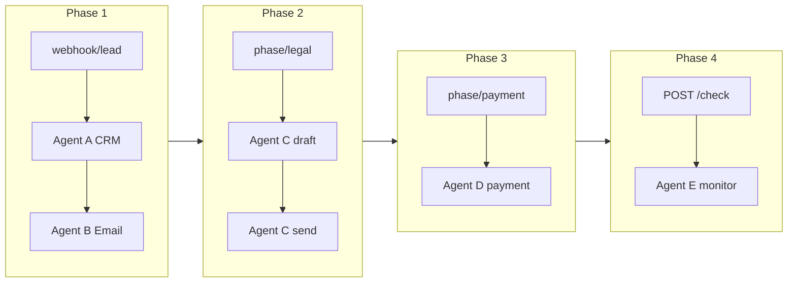

# AceLink pipeline — triggers by phase

John (local FastAPI) orchestrates Agents **A–E** on Supervity. Each phase has one **HTTP trigger**, writes to **Supabase**, and sets `next_event` for the UI.

| Phase | When | Trigger | Agents | Supabase `crm_activity_logs` |
|-------|------|---------|--------|--------------------------------|
| **1** | New lead from website / Max | `POST /api/orchestrator/webhook/lead` | A (CRM), B (email) | `lead_created`, `outreach_dispatched` |
| **2** | Meeting done, transcript ready | `POST /api/orchestrator/phase/legal` or `POST /events` `transcript_ready` | C (legal draft + send) | `transcript_saved`, `contract_drafted`, `contract_sent` |
| **3** | Contract signed | `POST /api/orchestrator/phase/payment` or `POST /events` `contract_signed` | D (payment link) | `payment_link_sent` |
| **4** | Ops clicks “Check” in Command Center | `POST /api/orchestrator/check` | E (monitor) | `monitor_check` |

**Headers (all phases except health):**

```
X-Webhook-Secret: <ORCHESTRATOR_WEBHOOK_SECRET>
ngrok-skip-browser-warning: true   # if using ngrok free tier
```

Replace `BASE` with your public URL (e.g. ngrok → `https://….ngrok-free.dev`).

---

## Phase 1 — Lead intake (already working)

```bash
curl -X POST "BASE/api/orchestrator/webhook/lead" \
  -H "Content-Type: application/json" \
  -H "X-Webhook-Secret: SECRET" \
  -d '{
    "event": "lead_created",
    "source": "AceLink Website",
    "lead_payload": {
      "name": "Tristan Singh",
      "email": "tristan@example.com",
      "company": "Ovelia Health",
      "project_type": "website",
      "budget": "around 5 lakhs",
      "timeline": "October 2026"
    }
  }'
```

**Response:** `lead_id` (UUID) — save this for Phase 2+.

**Supabase:** `leads.lead_status` → `qualified` (hot); timeline shows outreach.

---

## Phase 2 — Legal (transcript → contract email)

**Trigger:** Human or Max posts transcript after the meeting.

**Requirements:**

- Valid `lead_id` from Phase 1
- Real transcript text (not “lead onboarding completed” placeholder)
- `SUPERVITY_WORKFLOW_LEGAL` configured

```bash
LEAD_ID="<uuid-from-phase-1>"

curl -X POST "BASE/api/orchestrator/phase/legal" \
  -H "Content-Type: application/json" \
  -H "X-Webhook-Secret: SECRET" \
  -d "{
    \"lead_id\": \"$LEAD_ID\",
    \"transcript_payload\": {
      \"project_description\": \"Client wants a marketing site with blog, contact form, and CMS. Budget confirmed at 5 lakhs. Launch by October 2026.\",
      \"scoped_budget\": \"500000\",
      \"scoped_timeline\": \"October 2026\",
      \"meeting_transcript_summary\": \"Discussed scope, timeline, and deposit terms.\"
    }
  }"
```

**Alternate (same behavior):**

```bash
curl -X POST "BASE/api/orchestrator/events" \
  -H "Content-Type: application/json" \
  -H "X-Webhook-Secret: SECRET" \
  -d "{
    \"event\": \"transcript_ready\",
    \"lead_id\": \"$LEAD_ID\",
    \"transcript_payload\": { \"project_description\": \"...\" }
  }"
```

**John flow:**

1. Save `meeting_transcripts`
2. Log `transcript_saved`
3. Agent C: `task=draft_contract`
4. Log `contract_drafted`
5. Agent C: `task=send_contract_email`
6. Log `contract_sent`
7. `leads.lead_status` → `proposal_sent`

**Next:** `wait_for_signature` → run Phase 3 when signed.

**Test Agent C only (no John):**

```bash
python scripts/test_all_agents.py legal
```

---

## Phase 3 — Payment link

**Trigger:** Contract signed (manual button, webhook, or operator callback).

```bash
curl -X POST "BASE/api/orchestrator/phase/payment" \
  -H "Content-Type: application/json" \
  -H "X-Webhook-Secret: SECRET" \
  -d "{
    \"lead_id\": \"$LEAD_ID\",
    \"deposit_amount_usd\": 150000
  }"
```

**Alternate:**

```bash
curl -X POST "BASE/api/orchestrator/events" \
  -H "Content-Type: application/json" \
  -H "X-Webhook-Secret: SECRET" \
  -d "{ \"event\": \"contract_signed\", \"lead_id\": \"$LEAD_ID\" }"
```

**Supabase:** `payment_link_sent`; `leads.lead_status` → `negotiation`.

**Test Agent D only:**

```bash
python scripts/test_all_agents.py payment
```

---

## Phase 4 — Monitor (on demand)

**Trigger:** Command Center “Check” — **no cron**.

```bash
curl -X POST "BASE/api/orchestrator/check" \
  -H "Content-Type: application/json" \
  -H "X-Webhook-Secret: SECRET" \
  -d "{
    \"action\": \"check\",
    \"lead_id\": \"$LEAD_ID\",
    \"silence_threshold_days\": 4
  }"
```

**Supabase:** `monitor_check` in `crm_activity_logs`.

---

## End-to-end test script

```bash
# Phase 1 → returns lead_id in JSON
python scripts/test_phase_pipeline.py

# Or test Supervity agents directly
python scripts/test_all_agents.py
```

---

## Pipeline diagram


